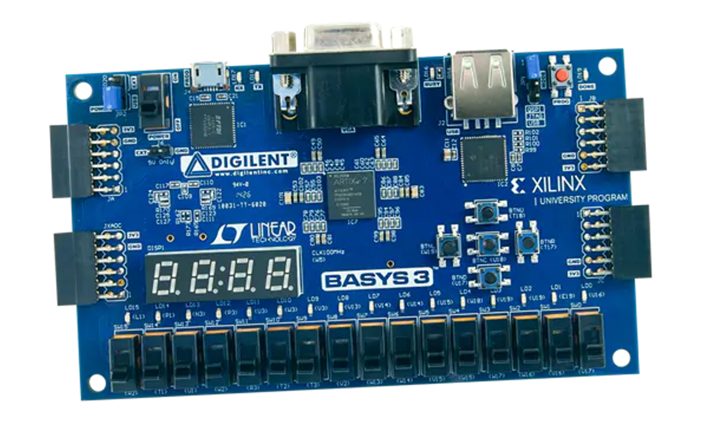
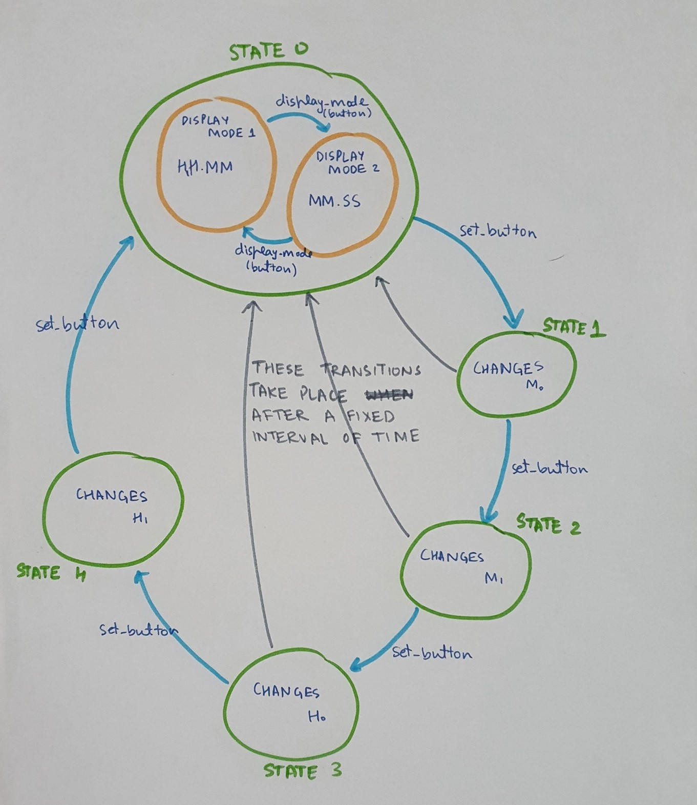

# Digital Clock

## Introduction:

This is a design of a digital clock which displays time in hours, minutes and seconds. It has
been implemented on a BASYS3 FPGA board.

  

The main features are :
1) 24 hour format
2) 2 display modes which show HH.MM and MM.SS (with decimal point blinking at each second)
3) Digit wise setting clock time
4) Reset clock with just one click

## Design Overview:
All of the major design decisions were taken keeping in mind the convenience of the user. Some of them are:

1) Chose to provide the feature of being able to set each digit independently. It is much more convenient.

2) Chose against a seconds setting option. I believe that there is no practical use of being able to change the seconds in a clock. If in some situation it is really needed, then it can be done in a maximum time of 60 seconds by changing the minutes value.

3) Incorporated both increment and decrement because I believe it is much more convenient to do 5 presses of a button instead of 10 to reach the desired value. For 4 digits, it is a maximum of 20 presses. Had I only implemented increment, it would have been 40 presses. According to me, having dedicated buttons for increment and decrement on the clock is more convenient.

4) Incorporated two display modes. One of them displays time in the format HH.MM. The other mode displays time in the format MM.SS. The central decimal point blinks at each second in both the modes.

## State Diagram:

  

## Design Description:
Two entity-architecture pairs have been defined:
1) to_display
2) dig_clock

Please refer to [this document](Project_Description.pdf) for detailed discussion.

Course Project | COL215: Digital Logic and System Design | Prof. Anshul Kumar | Fall 2020-21.

**Note:** Due to covid, we were unable to access the lab and therefore the equipment (BASYS3 FPGA boards). The above code has not (yet) been run on a board. Might need some debugging.
